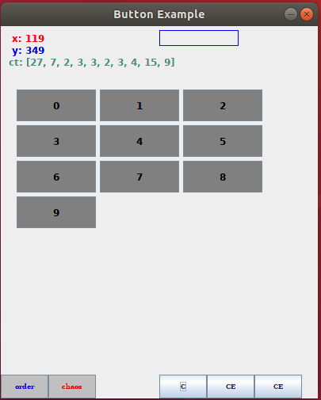
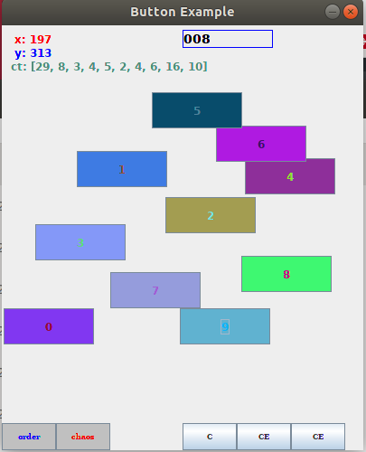

# Example 5 code

Hitting the order button puts all the added JButton objects in a designed order. 

Then hitting the chaos button calls a function to randomly assigns the forground color, background color, x position and y position. 

